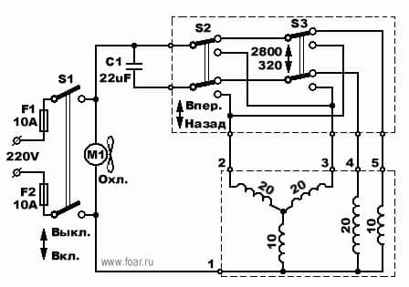

# Разработка полуавтомат стиральной машины типа СМП-3Б (Урал)

Микроконтроллер ESP32 на Lua

Стиралка имеет двухобмоточный НЕколлекторный движок

Тут форум по движку "http://www.foar.ru/topic.php?forum=30&topic=39&p=1